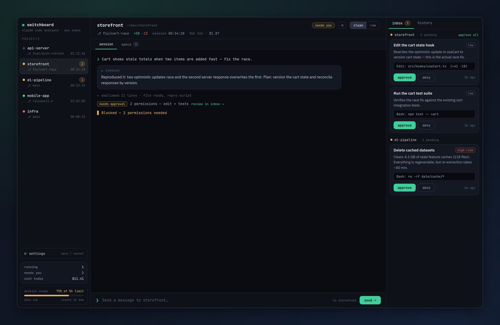

<div align="center">



# Switchboard

**Every Claude Code session. One window. Zero terminal juggling.**

Stop alt-tabbing between four PowerShell windows to find the one session that's waiting on you.
Switchboard hosts all of your Claude Code sessions in a single desktop app — with a central
permission inbox, per-project context, and output views that only show you what matters.

> This is a purely vibecoded app. The only intention was to make my daily workflow easier and
> better to work with.

[](https://www.electronjs.org/)
[](https://vuejs.org/)
[](https://www.typescriptlang.org/)
[](https://docs.claude.com/en/api/agent-sdk/overview)
[](#getting-started)

</div>

---

## The problem

If you run Claude Code seriously, your desktop ends up looking like this: a grid of terminal
windows, each hosting its own session, each occasionally stopping dead to ask *"Can I run this
command?"* — and no way to tell which one needs you without clicking through all of them.

You lose time to window management. You miss permission prompts for minutes at a time. You
scroll through walls of build output to find the one line the model actually said. And every
project lives in its own disconnected island.

**Switchboard turns that grid of terminals into a single control room.**

## What you get

### 🗂 All your projects, one sidebar

Every project gets a lane. Every session shows its live status at a glance — **working**,
**needs you**, **done**, or **error** — along with the git branch, working-tree diff size,
and a subscription usage meter. When something needs your attention, you see it immediately.
No more guessing which window is stuck.

### 📥 A central permission inbox

Permission prompts and plan approvals from *every* session land in one inbox, classified by
risk (low / medium / high) with first-match rules you can edit. Approve, deny, or — for
requests you'd always allow — create a **standing rule** scoped to the project: by command
prefix, path glob, exact input, or tool. Every decision is recorded in a reviewable history.

Sessions stop blocking on you, and you stop babysitting them.

### 🧹 Clean output, on your terms

The clean view swallows noise — build spew, verbose tool chatter — behind collapsible blocks
labeled by kind, driven by editable global and per-project swallow rules. Questions from
Claude render as clickable options instead of raw text. The full raw stream is always one
toggle away.

### ⚡ Keep sessions moving while you're away

Queue prompts to auto-run the moment a session goes idle. Drafts survive an app restart.
Desktop notifications tell you when a session needs a decision — carrying nothing more
sensitive than the project name and item title.

### 📋 Spec Kit, built in

For projects using [github/spec-kit](https://github.com/github/spec-kit), Switchboard shows
each feature spec with its task progress, open clarifications, and one-click buttons for the
full slash-command flow: `/specify`, `/clarify`, `/plan`, `/tasks`, `/analyze`, `/checklist`,
`/implement`.

### 🎛 Tuned for how you work

Pick separate models for planning turns and work turns. Flip on **terse mode**
(lite / full / ultra) to cut output tokens without losing code, commands, or errors.
The app keeps itself current via auto-update from GitHub releases.

## Getting started

**Prerequisites:** Node.js 20+, npm, and an authenticated
[Claude Code](https://docs.claude.com/en/docs/claude-code/overview) installation on Windows.

```powershell
git clone https://github.com/<owner>/<repo>.git
cd terminal-switchboard
npm install
npm run dev
```

Register a project (Switchboard also suggests likely project folders), start a session, and
prompt away. Build a distributable with:

```powershell
npm run package      # NSIS installer (auto-updating)
```

## Development

```powershell
npm run dev          # Electron + Vite with hot reload (swaps better-sqlite3 to the Electron ABI)
npm run test         # Vitest unit tests (swaps better-sqlite3 back to the Node ABI)
npm run test:e2e     # Playwright against the mock session host (no live sessions)
npm run lint         # ESLint
npm run typecheck    # tsc (main/preload) + vue-tsc (renderer)
npm run prune -- --dry-run   # Preview the retention job
npm run package      # electron-builder distributable
```

### Native module note

`better-sqlite3` ships different ABIs for Node and Electron. `scripts/swap-sqlite.mjs`
downloads the matching prebuilt binary automatically: `npm run dev` targets Electron,
`npm test` targets Node. No C++ toolchain required.

### Real-session smoke test

The default suite never talks to Claude. To validate the live integration against an
authenticated Claude Code installation (spends a small number of real tokens):

```powershell
$env:REAL_SESSION = '1'
npx vitest run tests/unit/real-session.spec.ts
```

## Architecture

```
src/
├── main/            Electron main process
│   ├── sessions/    Claude Agent SDK session hosting & event mapping
│   ├── inbox/       Permission broker, risk rules, standing rules
│   ├── stream/      Output swallow classifier
│   ├── specs/       Spec Kit discovery & parsing
│   ├── projects/    Project registration & discovery
│   └── store/       SQLite (better-sqlite3) repositories & retention
├── preload/         Typed contextBridge (invoke + validated push channels)
├── renderer/        Vue 3 + Pinia UI
└── shared/          Domain types shared across processes
```

All SDK usage is confined to the main process; the renderer talks only through a typed IPC
bridge. Specification and design live in `specs/001-terminal-switchboard/`.

## Privacy & security

Everything stays on your machine. All data lives in local SQLite at
`%APPDATA%\terminal-switchboard\switchboard.db`; the app itself transmits nothing — the only
network traffic is the Claude Agent SDK talking to Anthropic. The renderer runs with context
isolation, no Node integration, a strict CSP, and a structured error envelope. See
[`docs/security-review.md`](docs/security-review.md) for the full review.

## Releasing

Installed builds auto-update from GitHub releases via `electron-updater`:

1. Bump `version` in `package.json`.
2. Point `publish` in `electron-builder.yml` at your `owner`/`repo`.
3. With a `GH_TOKEN` that can create releases:

   ```powershell
   npm run build
   npx electron-builder --win --publish always
   ```

Auto-update requires the NSIS installer target (the portable exe cannot self-update).
Unsigned builds still update, but SmartScreen warns until a signing certificate is configured.

---

<div align="center">

Powered by the [Claude Agent SDK](https://docs.claude.com/en/api/agent-sdk/overview)

</div>
