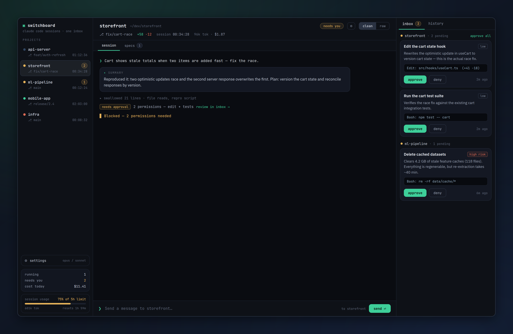

<div align="center">



# Switchboard

**Every Claude Code session. One window. Zero terminal juggling.**

Stop alt-tabbing between four PowerShell windows to find the one session that's waiting on you.
Switchboard hosts all of your Claude Code sessions in a single desktop app — with a central
permission inbox, per-project context, and output views that only show you what matters.

> This is a purely vibecoded app. The only intention was to make my daily workflow easier and
> better to work with.

[](https://www.electronjs.org/)
[](https://vuejs.org/)
[](https://www.typescriptlang.org/)
[](https://docs.claude.com/en/api/agent-sdk/overview)
[](#getting-started)

</div>

---

## The problem

If you run Claude Code seriously, your desktop ends up looking like this: a grid of terminal
windows, each hosting its own session, each occasionally stopping dead to ask *"Can I run this
command?"* — and no way to tell which one needs you without clicking through all of them.

You lose time to window management. You miss permission prompts for minutes at a time. You
scroll through walls of build output to find the one line the model actually said. And every
project lives in its own disconnected island.

**Switchboard turns that grid of terminals into a single control room.**

## What you get

### 🗂 All your projects, one sidebar

Every project gets a lane. Every session shows its live status at a glance — **working**,
**needs you**, **done**, or **error** — along with the git branch, working-tree diff size,
and a subscription usage meter. When something needs your attention, you see it immediately.
No more guessing which window is stuck.

### 📥 A central permission inbox

Permission prompts and plan approvals from *every* session land in one inbox, classified by
risk (low / medium / high) with first-match rules you can edit. Approve, deny, or — for
requests you'd always allow — create a **standing rule** scoped to the project: by command
prefix, path glob, exact input, or tool. Every decision is recorded in a reviewable history.

Sessions stop blocking on you, and you stop babysitting them.

### 🧹 Clean output, on your terms

The clean view swallows noise — build spew, verbose tool chatter — behind collapsible blocks
labeled by kind, driven by editable global and per-project swallow rules. Questions from
Claude render as clickable options instead of raw text. The full raw stream is always one
toggle away.

### ⚡ Keep sessions moving while you're away

Queue prompts to auto-run the moment a session goes idle. Drafts survive an app restart.
Desktop notifications tell you when a session needs a decision — carrying nothing more
sensitive than the project name and item title.

### 📋 Spec Kit, built in

For projects using [github/spec-kit](https://github.com/github/spec-kit), Switchboard shows
each feature spec with its task progress, open clarifications, and one-click buttons for the
full slash-command flow: `/specify`, `/clarify`, `/plan`, `/tasks`, `/analyze`, `/checklist`,
`/implement`.

### 🎛 Tuned for how you work

Pick separate models for planning turns and work turns. Flip on **terse mode**
(lite / full / ultra) to cut output tokens without losing code, commands, or errors.
The app keeps itself current via auto-update from GitHub releases.

## Built with

**Runtime**

- [`@anthropic-ai/claude-agent-sdk`](https://docs.claude.com/en/api/agent-sdk/overview) — hosts every Claude Code session
- [`vue`](https://vuejs.org/) — renderer UI; state is plain `reactive()` module stores
- [`node:sqlite`](https://nodejs.org/api/sqlite.html) — the runtime's own synchronous SQLite store, so there is no native module to build
- [`electron-updater`](https://www.electron.build/auto-update) — in-app update from the GitHub release feed

**Build & packaging**

- [`electron`](https://www.electronjs.org/) — desktop shell
- [`electron-vite`](https://electron-vite.org/) + [`vite`](https://vite.dev/) + [`@vitejs/plugin-vue`](https://github.com/vitejs/vite-plugin-vue) — dev server and bundling
- [`electron-builder`](https://www.electron.build/) + [`@electron/fuses`](https://github.com/electron/fuses) — NSIS installer and runtime hardening

**Quality & tooling**

- [`typescript`](https://www.typescriptlang.org/) + [`vue-tsc`](https://github.com/vuejs/language-tools) — typing across processes
- [`vitest`](https://vitest.dev/) + [`@playwright/test`](https://playwright.dev/) — unit and end-to-end tests
- [`eslint`](https://eslint.org/) ([`typescript-eslint`](https://typescript-eslint.io/), [`eslint-plugin-vue`](https://eslint.vuejs.org/), [`eslint-config-prettier`](https://github.com/prettier/eslint-config-prettier)) + [`prettier`](https://prettier.io/) — linting and formatting
- [`tsx`](https://github.com/privatenumber/tsx) — runs the TypeScript retention CLI

### The agent toolchain

Switchboard is built with Claude Code, and the same plugins and skills are installed at
**user scope** so every project — and every session Switchboard itself hosts — is shaped the
same way. Two of them shape the output style: `i-have-adhd` for action-first, numbered,
no-preamble answers, and `ponytail` for lazy, minimal code. Switchboard passes that style
through to the sessions it runs.

**Plugins** (`claude plugin marketplace add <repo>` then `claude plugin install <pkg> --scope user`)

| Plugin | Source | What it is for |
| --- | --- | --- |
| `i-have-adhd` | [ayghri/i-have-adhd](https://github.com/ayghri/i-have-adhd) | Output style: action first, numbered, no preamble |
| `ponytail` | [DietrichGebert/ponytail](https://github.com/DietrichGebert/ponytail) | Lazy senior developer — YAGNI, deletion over addition |
| `mattpocock-skills` | [mattpocock/skills](https://github.com/mattpocock/skills) | 34 engineering skills, including `grill-me` and `handoff` |
| `dotnet-claude-kit` | [codewithmukesh/dotnet-claude-kit](https://github.com/codewithmukesh/dotnet-claude-kit) | .NET architecture, scaffolding and the Roslyn navigator MCP |
| `ui-ux-pro-max` | [nextlevelbuilder/ui-ux-pro-max-skill](https://github.com/nextlevelbuilder/ui-ux-pro-max-skill) | Design, design-system and UI-styling skills |
| `diagram-design` | [cathrynlavery/diagram-design](https://github.com/cathrynlavery/diagram-design) | Draws the editorial HTML diagrams the Diagrams tab lists |
| `wt-agent-hooks` | local directory | Terminal integration hooks |

**Skills used most often, by plugin**

- `mattpocock-skills` — `grill-me` and `grilling` (a relentless interview that sharpens a plan
  before any code is written), `handoff` (compacts a conversation into a document a fresh
  agent can pick up), plus `tdd`, `code-review`, `diagnosing-bugs`, `domain-modeling`,
  `to-spec`, `to-tickets` and `research`.
- `ui-ux-pro-max` — `design`, `design-system`, `ui-styling`.
- `dotnet-claude-kit` — `scaffold`, and the `code-reviewer`, `ef-core-specialist`,
  `security-auditor` and `test-engineer` subagents.
- `diagram-design` — `export-diagram`, `import-mermaid`, `import-drawio`, all three offered
  from the Diagrams tab's Commands menu.

**Standalone skills** in `~/.claude/skills/`, available to every project without a plugin:
[`github/spec-kit`](https://github.com/github/spec-kit) (`speckit`, `speckit-implement-scaffold`)
for specs, and a set of repo-specific Clean Architecture and PL/SQL skills.

## Getting started

**Prerequisites:** Node.js 22.5+ (the store uses `node:sqlite`), npm, and an authenticated
[Claude Code](https://docs.claude.com/en/docs/claude-code/overview) installation on Windows.

```powershell
git clone https://github.com/<owner>/<repo>.git
cd terminal-switchboard
npm install
npm run dev
```

Register a project (Switchboard also suggests likely project folders), start a session, and
prompt away. Build a distributable with:

```powershell
npm run package      # NSIS installer (auto-updating)
```

## Development

```powershell
npm run dev          # Electron + Vite with hot reload
npm run test         # Vitest unit tests
npm run test:e2e     # Playwright against the mock session host (no live sessions)
npm run lint         # ESLint
npm run typecheck    # tsc (main/preload) + vue-tsc (renderer)
npm run prune -- --dry-run   # Preview the retention job
npm run package      # electron-builder distributable
```

There are no native modules and therefore no rebuild step: the store runs on the
runtime's own `node:sqlite`, so the same code loads under Electron and under Vitest.

### Real-session smoke test

The default suite never talks to Claude. To validate the live integration against an
authenticated Claude Code installation (spends a small number of real tokens):

```powershell
$env:REAL_SESSION = '1'
npx vitest run tests/unit/real-session.spec.ts
```

## Architecture

```
src/
├── main/            Electron main process
│   ├── sessions/    Claude Agent SDK session hosting & event mapping
│   ├── inbox/       Permission broker, risk rules, standing rules
│   ├── stream/      Output swallow classifier
│   ├── specs/       Spec Kit discovery & parsing
│   ├── projects/    Project registration & discovery
│   └── store/       SQLite (node:sqlite) repositories & retention
├── preload/         Typed contextBridge (invoke + validated push channels)
├── renderer/        Vue 3 UI (reactive() module stores)
└── shared/          Domain types shared across processes
```

All SDK usage is confined to the main process; the renderer talks only through a typed IPC
bridge. Specification and design live in `specs/001-terminal-switchboard/`.

## Privacy & security

Everything stays on your machine. All data lives in local SQLite at
`%APPDATA%\terminal-switchboard\switchboard.db`; the app itself transmits nothing — the only
network traffic is the Claude Agent SDK talking to Anthropic. The renderer runs with context
isolation, no Node integration, a strict CSP, and a structured error envelope. See
[`docs/security-review.md`](docs/security-review.md) for the full review.

## Releasing

Installed builds check for updates with `electron-updater`, which reads `latest.yml`
from the GitHub release (see `src/main/updater.ts`). Both artefacts must be attached
to every release: without `latest.yml` the updater cannot resolve the new version, and
it is also where the SHA-512 it verifies the download against lives.

1. Bump `version` in `package.json`.
2. Build both artefacts:

   ```powershell
   npm run package
   ```

   This produces `release/Switchboard-Setup-<version>.exe` and `release/latest.yml`.
3. Run `npm run verify-release`. This exists because a release missing
   `latest.yml`, or one whose recorded version or SHA-512 no longer matches the
   installer on disk, is silently un-updatable rather than visibly broken — the
   gate catches that before it reaches users. It checks that `latest.yml`
   exists and parses, that its version matches `package.json`, that the
   installer it names exists, and that a freshly computed SHA-512 of that
   installer matches the one recorded. It exits non-zero with a specific
   message on any failure.
4. Publish a GitHub release, attaching both:

   ```powershell
   gh release create v<version> `
     "release/Switchboard-Setup-<version>.exe" "release/latest.yml" `
     --title "<version>" --notes "..."
   ```

Unsigned builds still install, but SmartScreen warns on first run until a signing
certificate is configured.

---

<div align="center">

Powered by the [Claude Agent SDK](https://docs.claude.com/en/api/agent-sdk/overview)

</div>
